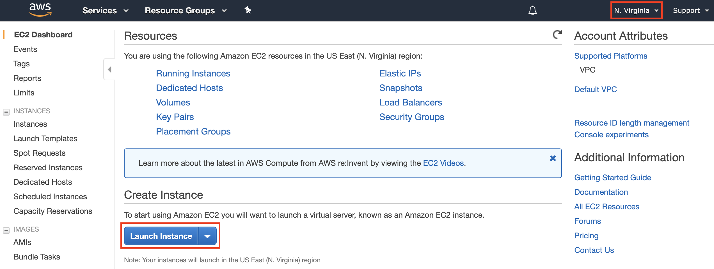
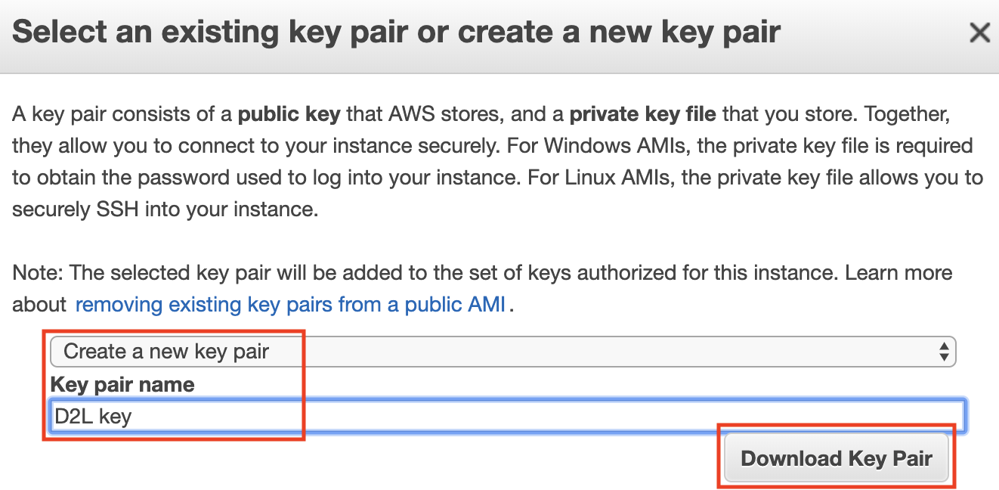

# Using AWS Instances

Many deep learning applications require significant amounts of computation. Your local machine might be too slow to solve these problems in a reasonable amount of time. Cloud computing services can give you access to more powerful computers to run the GPU intensive portions of this book. In this section, we will show you how to set up an instance. We will use Jupyter Notebooks to run code on AWS (Amazon Web Services). The walkthrough includes a number of steps:

1. Request for a GPU instance. 
1. Optionally: install CUDA or use an AMI with CUDA preinstalled. 
1. Set up the corresponding MXNet GPU version.

This process applies to other instances (and other clouds), too, albeit with some minor modifications. 


## Register Account and Log In

First, we need to register an account at https://aws.amazon.com/. We strongly encourage you to use two-factor authentication for additional security. Furthermore, it is a good idea to set up detailed billing and spending alerts to avoid any unexpected surprises if you forget to suspend your computers. Note that you will need a credit card. 
After logging into your AWS account, click "EC2" (marked by the red box in the figure below) to go to the EC2 panel.


## Create and Run an EC2 Instance

Figure 14.9 shows the EC2 panel with sensitive account information greyed out. Select a nearby data center to reduce latency, e.g. Oregon. If you are located in China you can select a nearby Asia Pacific region, such as Seoul or Tokyo. Please note that some data centers may not have GPU instances. Click the "Launch Instance" button marked by the red box in Figure 14.8 to launch your instance.



We begin by selecting a suitable AMI (AWS Machine Image). If you want to install everything including the CUDA drivers from scratch, choose Ubuntu. Instead we recommend that you use the Deep Learning AMI that comes with all the drivers preconfigured. 

The row at the top of Figure 14.10 shows the steps required to configure the instance. Search for *Deep Learning Base* and select the Ubuntu flavor.


EC2 provides many different instance configurations to choose from. This can sometimes feel overwhelming to a beginner. Here's a table of suitable machines:

| Name | GPU         | Notes                         |
|------|-------------|-------------------------------|
| g2   | Grid K520   | ancient                       |
| p2   | Kepler K80  | old but often cheap as spot   |
| g3   | Maxwell M60 | good trade-off                |
| p3   | Volta V100  | high performance for FP16     |
| g4   | Turing T4   | inference optimized FP16/INT8 |

All the above servers come in multiple flavors indicating the number of GPUs used. E.g. a p2.xlarge has 1 GPU and a p2.16xlarge has 16 GPUs and more memory. For more details see e.g. the [AWS EC2 documentation](https://aws.amazon.com/ec2/instance-types/) or a [summary page](https://www.ec2instances.info). For the purpose of illustration a p2.xlarge will suffice.

**Note:** you must use a GPU enabled instance with suitable drivers and a version of MXNet that is GPU enabled. Otherwise you will not see any benefit from using GPUs. 


Before choosing an instance, we suggest you check if there are quantity restrictions by clicking the "Limits" label in the bar on the left as shown in Figure 14.9. Figure 14.12 shows an example of such a limitation. The account can only open one "p2.xlarge" instance per region. If you need to open more instances, click on the "Request limit increase" link to apply for a higher instance quota. Generally, it takes one business day to process an application.


So far, we have finished the first two of seven steps for launching an EC2 instance, as shown on the top of Fig 14.13. In this example, we keep the default configurations for the steps "3. Configure Instance", "5. Add Tags", and "6. Configure Security Group". Tap on "4. Add Storage" and increase the default hard disk size to 64 GB. Note that CUDA by itself already takes up 4GB.


Finally, go to "7. Review" and click "Launch" to launch the configured instance. The system will now prompt you to select the key pair used to access the instance. If you do not have a key pair, select "Create a new key pair" in the first drop-down menu in Figure 14.14 to generate a key pair. Subsequently, you can select "Choose an existing key pair" for this menu and then select the previously generated key pair. Click "Launch Instances" to launch the created instance.



Make sure that you download the keypair and store it in a safe location if you generated a new one. This is your only way to SSH into the server. Click the instance ID shown in Figure 14.15 to view the status of this instance.


As shown in Figure 14.16, after the instance state turns green, right-click the instance and select "Connect" to view the instance access method. For example, enter the following in the command line:

```
ssh -i "/path/to/key.pem" ubuntu@ec2-xx-xxx-xxx-xxx.y.compute.amazonaws.com
```

Here, "/path/to/key.pem" is the path of the locally-stored key used to access the instance. When the command line prompts "Are you sure you want to continue connecting (yes/no)", enter "yes" and press Enter to log into the instance.


It is a good idea to update the instance with the latest drivers.

```
sudo apt update
sudo apt dist-upgrade
```

Your server is ready now.

## Installing CUDA

If you used the Deep Learning AMI you can skip the steps below since it already comes with a range of CUDA versions pre-installed. Instead, all you need to do is select the CUDA version of your choice as follows:

```
sudo rm -r /usr/local/cuda
sudo ln -s /usr/local/cuda-10.0 /usr/local/cuda
```

This selects CUDA 10.0 as the default. 

If you prefer to take the scenic route, please follow the path below. First, update and install the package needed for compilation.

```
sudo apt update 
sudo apt dist-upgrade
sudo apt install -y build-essential git libgfortran3
```

NVIDIA frequently releases updates to CUDA (typically one major version per year). Here we download CUDA 10.0. Visit NVIDIA's official repository at (https://developer.nvidia.com/cuda-toolkit-archive) to find the download link of CUDA 10.0 as shown below.


After copying the download address in the browser, download and install CUDA 10.0. Presently the following link is up to date:

```
# The download link and file name are subject to change, so always use those
# from the NVIDIA website
wget https://developer.nvidia.com/compute/cuda/10.0/Prod/local_installers/cuda_10.0.130_410.48_linux
sudo sh cuda_10.0.130_410.48_linux    
```

Press "Ctrl+C" to jump out of the document and answer the following questions.

```
The NVIDIA CUDA Toolkit provides command-line and graphical
tools for building, debugging and optimizing the performance
Do you accept the previously read EULA?
accept/decline/quit: accept

Install NVIDIA Accelerated Graphics Driver for Linux-x86_64 410.48?
(y)es/(n)o/(q)uit: y

Do you want to install the OpenGL libraries?
(y)es/(n)o/(q)uit [ default is yes ]: y

Do you want to run nvidia-xconfig?
This will update the system X configuration file so that the NVIDIA X driver
is used. The pre-existing X configuration file will be backed up.
This option should not be used on systems that require a custom
X configuration, such as systems with multiple GPU vendors.
(y)es/(n)o/(q)uit [ default is no ]: n

Install the CUDA 10.0 Toolkit?
(y)es/(n)o/(q)uit: y

Enter Toolkit Location
 [ default is /usr/local/cuda-10.0 ]: 

Do you want to install a symbolic link at /usr/local/cuda?
(y)es/(n)o/(q)uit: y

Install the CUDA 10.0 Samples?
(y)es/(n)o/(q)uit: n
```

After installing the program, run the following command to view the instance GPU.

```
nvidia-smi
```

Finally, add CUDA to the library path to help other libraries find it.

```
echo "export LD_LIBRARY_PATH=\${LD_LIBRARY_PATH}:/usr/local/cuda/lib64" >> ~/.bashrc
```

## Install MXNet and Download the D2L Notebooks

For detailed instructions see the introduction where we discussed how to ["Get started with Gluon"](../chapter_prerequisite/install.md). First, install Miniconda for Linux.

```
# The download link and file name are subject to change, so always use those
# from the Miniconda website
wget https://repo.anaconda.com/miniconda/Miniconda3-latest-Linux-x86_64.sh
sudo sh Miniconda3-latest-Linux-x86_64.sh
```

Now, you need to answer the following questions:

```
Do you accept the license terms? [yes|no]
[no] >>> yes
Do you wish the installer to prepend the Miniconda3 install location
to PATH in your /home/ubuntu/.bashrc ? [yes|no]
[no] >>> yes
```

After installation, run `source ~/.bashrc` once to activate CUDA and Conda. Next, download the code for this book and install and activate the Conda environment. To use GPUs you need to update MXNet to request the CUDA 10.0 build.

```
sudo apt install unzip
mkdir d2l-en && cd d2l-en
wget https://www.d2l.ai/d2l-en.zip 
unzip d2l-en.zip && rm d2l-en.zip
sed -i 's/mxnet/mxnet-cu100/g' environment.yml
conda env create -f environment.yml
source activate gluon
```

You can test quickly whether everything went well as follows:

```
$ conda activate gluon
$ python
>>> import mxnet as mx
>>> ctx = mx.gpu(0)
>>> x = mx.ndarray.zeros(shape=(1024,1024), ctx=ctx)
```

## Running Jupyter

To run Jupyter remotely you need to use SSH port forwarding. After all, the server in the cloud doesn't have a monitor or keyboard. For this, log into your server from your desktop (or laptop) as follows.

```
# This command must be run in the local command line
ssh -i "/path/to/key.pem" ubuntu@ec2-xx-xxx-xxx-xxx.y.compute.amazonaws.com -L 8889:localhost:8888
conda activate gluon
jupyter notebook
```

Figure 14.18 shows the possible output after you run Jupyter Notebook. The last row is the URL for port 8888.


Since you used port forwarding to port 8889 you will need to replace the port number and use the secret as given by Jupyter when opening the URL in your local browser.

## Closing Unused Instances

As cloud services are billed by the time of use, you should close instances that are not being used. Note that there are alternatives: *Stopping* an instance means that you will be able to start it again. This is akin to switching off the power for your regular server. However, stopped instances will still be billed a small amount for the hard disk space retained. *Terminate* deletes all data associated with it. This includes the disk, hence you cannot start it again. Only do this if you know that you won't need it in the future.

If you want to use the instance as a template for many more instances, right-click on the example in Figure 14.16 and select "Image" $\rightarrow$ "Create" to create an image of the instance. Once this is complete, select "Instance State" $\rightarrow$ "Terminate" to terminate the instance. The next time you want to use this instance, you can follow the steps for creating and running an EC2 instance described in this section to create an instance based on the saved image. The only difference is that, in "1. Choose AMI" shown in Figure 14.10, you must use the "My AMIs" option on the left to select your saved image. The created instance will retain the information stored on the image hard disk. For example, you will not have to reinstall CUDA and other runtime environments.

## Summary

* Cloud computing services offer a wide variety of GPU servers.
* You can launch and stop instances on demand without having to buy and build your own computer. 
* You need to install suitable GPU drivers before you can use them. 

## Exercises

1. The cloud offers convenience, but it does not come cheap. Find out how to launch [spot instances](https://aws.amazon.com/ec2/spot/) to see how to reduce prices. 
1. Experiment with different GPU servers. How fast are they?
1. Experiment with multi-GPU servers. How well can you scale things up? 

## Scan the QR Code to [Discuss](https://discuss.mxnet.io/t/2399)


